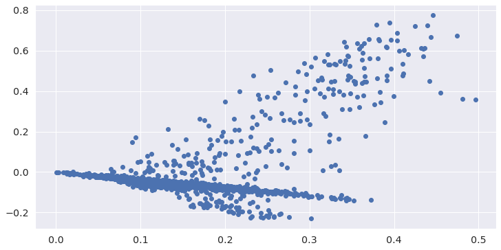
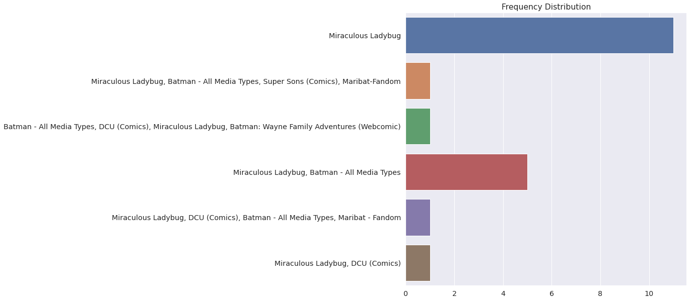
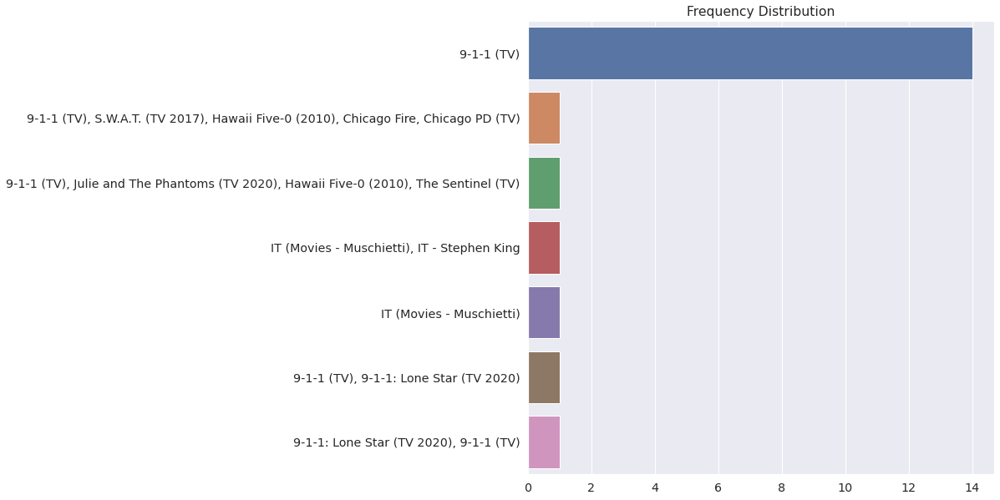
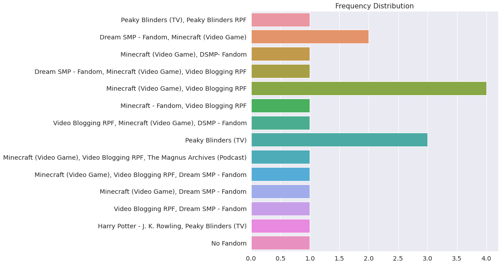
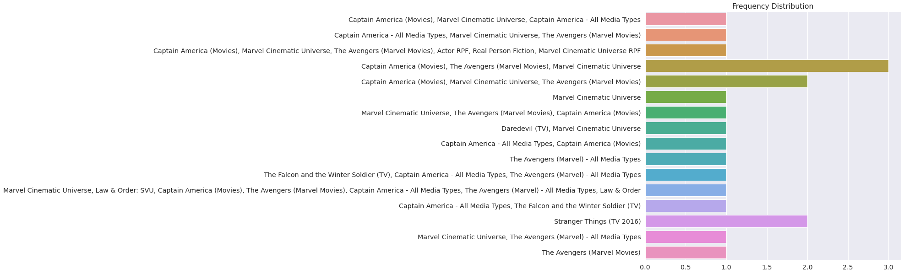
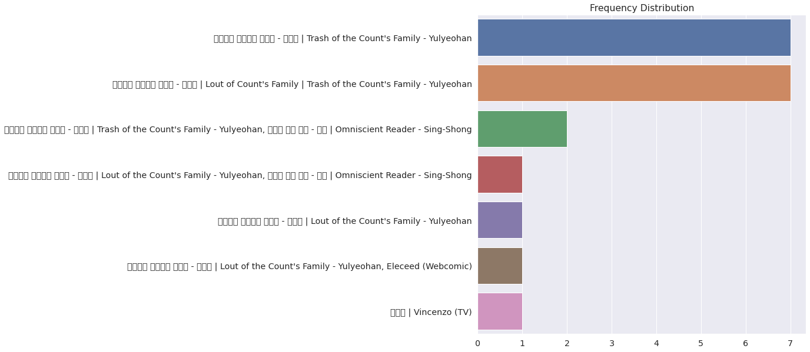

# Fanfiction Classification Analysis

by Rohan Bruce

## Introduction and Background

This project started because I wanted to look into something I was passionate about. I first wanted to look into recently published fiction, but given the difficulty of compiling a full dataset of that kind of data, I decided to instead look at fanfiction on archiveofourown.org (referred to throughout this report as AO3). As I was constructing this project, I had a fairly clear idea of what my data collection would look like, but I was much less clear on my plans for analysis. At the beginning of this project, I intended to do a lot of stylistic analysis, with a smaller subfocus on machine learning. Over the course of my project, this changed to a stronger focus on machine learning, and then clustering and topic modeling. Further detail on this in the section on analysis. However, over the course of the project, I have continued to focus in on identifying fandoms from text data.

## Data

### Sourcing
I collected my own data for this project. I used a spider that I built with the scrapy python module. It can be found [here](https://github.com/Data-Science-for-Linguists-2022/Fanfiction-Classification-Analysis/blob/main/fanfic_spider.py). I started on archiveofourown.org/media and let the spider crawl the site, looking for pages that started with numbers, because every fanfic found on the site has a url ending with a sequence of numbers after the main site url. I ended up collecting slightly over 10,000 individual fanfic pages, saved as html pages under a data folder that I did not upload to my Github repository. However, a sample of this dataset can be found in [the data_samples folder](https://github.com/Data-Science-for-Linguists-2022/Fanfiction-Classification-Analysis/tree/main/data_samples). It should be noted that each 'fanfic' mentioned here is in fact a single chapter of a longer fanfiction, as each chapter is saved in a separate webpage, and the spider makes it difficult to filter the fanfics collected.

### Cleaning
After I collected the data, it was time to clean it. This was where I started my very first Jupyter Notebook. The section where I first clean my data can be found [here](https://nbviewer.org/github/Data-Science-for-Linguists-2022/Fanfiction-Classification-Analysis/blob/main/fanfiction_data_parsing.ipynb#Reading-data-into-a-DataFrame), but I will give more detail on it here. First, I used the Beautiful Soup python library to convert my raw html files into searchable html files that I can run through in a systematic manner and extract relevant information while culling the unnecessary info. For context, AO3 uses a multitude of possible 'tag' categories that I wanted to use for my classification and analysis if possible. Luckily, each of these tags is actually saved as an html tag, so it was very easy to collect them and store them in a variety of data structures. These tags were Rating, Warning, Category, Fandom, Relationships, Characters, and Freeform (or additional). I also saved the actual text of each fanfic, of course, which I will focus on in more detail when we get to analysis. I placed all the tags and text into a DataFrame, which I saved into a pickle file that I did not upload to my Github repository.

### Summary Statistics
After I built my DataFrame, I went into some of the stats of the data to get a better idea of my dataset. [This section of my Jupyter Notebook](https://nbviewer.org/github/Data-Science-for-Linguists-2022/Fanfiction-Classification-Analysis/blob/main/fanfiction_data_parsing.ipynb#Looking-at-Statistics) features these summary statistics, and I will elaborate on some of them here, but all of them are found in my Jupyter notebook. In building my DataFrame, if there were multiple tags under one category, I concatenated them together connected by a comma. Each fanfic can only have one rating, so I could use the value_counts() command on the rating column of the DataFrame, but for the rest of the columns, each different collection of tags appears as a different value in the column even if they share one or more tags. So to be able to look at the most common tags outside of the confusion of these multi-tag values, I looked at the frequency of each value in the lists I created while I was cleaning my data. I did look at the most common tags in every category, but here I will focus on the fandom tags, because those are the tags I focus on in my analysis. The 20 most common fandom tags are: ('Harry Potter - J. K. Rowling', 753), ('僕のヒーローアカデミア | Boku no Hero Academia | My Hero Academia', 575), ('Marvel Cinematic Universe', 304), ('Minecraft (Video Game)', 300), ('Naruto', 241), ('Video Blogging RPF', 232), ('原神 | Genshin Impact (Video Game)', 205), ('Star Wars - All Media Types', 203), ('Encanto (2021)', 194), ('The Avengers (Marvel Movies)', 181), ('방탄소년단 | Bangtan Boys | BTS', 167), ("Five Nights at Freddy's", 167), ('Batman - All Media Types', 165), ('Shingeki no Kyojin | Attack on Titan', 132), ('鬼滅の刃 | Demon Slayer: Kimetsu no Yaiba (Anime)', 130), ('Biohazard | Resident Evil (Gameverse)', 129), ('Game of Thrones (TV)', 126), ('A Song of Ice and Fire - George R. R. Martin', 118), ('Miraculous Ladybug', 116), and ('Haikyuu!!', 115). We'll see these fandoms pop up more during analysis.

## Analysis

Here, I moved to another Jupyter Notebook, because I wanted to work with clustering and topic modeling on CRC. In [this section](https://nbviewer.org/github/Data-Science-for-Linguists-2022/Fanfiction-Classification-Analysis/blob/main/fanfic_clustering.ipynb#Importing-Necessary-Data-and-Recapping-Stats), I imported my pickled DataFrame and dropped all rows with null objects for cleaner analysis. In the next section, [here](https://nbviewer.org/github/Data-Science-for-Linguists-2022/Fanfiction-Classification-Analysis/blob/main/fanfic_clustering.ipynb#Clustering-and-Topic-Modeling), I started working with clustering and used that for topic modeling. Here, I'm going to start going into more detail on my individual findings. Here is my cluster graph with based on my SVD findings on my text data:

This data has a fairly defined shape, and I was very pleased with it. Using the clusters I observed in this graph, I started my topic modeling with four topics. This wasn't terribly effective, so I increased the number of topics to 20. This was probably too many topics, but it was better than 4, so I stuck with 20 topics for the remainder of my topic modeling. These were the 20 topics identified across my entire dataset:

Topic 0:
said just like didn know don asked time going really
Topic 1:
harry tom potter ron magic draco lord sirius lily boy
Topic 2:
chapter 10 12 11 13 14 16 15 17 18
Topic 3:
izuku katsuki midoriya hero bakugou boy students class kid school
Topic 4:
says like doesn just asks looks don feels know takes
Topic 5:
cock cum pussy hips mouth fuck ass lips fingers tongue
Topic 6:
peter tony stiles derek kid man mr boy okay apartment
Topic 7:
tommy wilbur techno dream george fucking sam boy arthur man
Topic 8:
jungkook jimin taehyung namjoon yoongi baby kim younger car eyes
Topic 9:
hermione draco ron potter george said year father magic harry
Topic 10:
eyes hand like face head man time felt away didn
Topic 11:
mirabel family town sister room mother children vision years daughter
Topic 12:
remus sirius james lily potter year black hermione boy magic
Topic 13:
omega alpha scent heat mate smell stiles katsuki mark derek
Topic 14:
naruto kakashi sasuke 10 team blonde san training boy son
Topic 15:
jason tim dick percy kid brother red father family users
Topic 16:
que la su en el se san son ya um
Topic 17:
lexi shit like girl party fucking sister car fuck house
Topic 18:
tony steve bucky sam james team mr man room kid
Topic 19:
obi wan anakin master force luke ship war order sir

14 of these topics appear to correlate with fandoms (including 2 duplicates, topics 9 and possibly 18). The rest of the topics include three seemingly random topics, one that is entirely numbers, one that includes explicit sexual content, and one that is entirely non-English words. However, I wanted to zoom in on topic modeling within each individual rating (if you'll remember, ratings were the only category that only had one tag in each row) and seeing how it correlated to fandoms. This is where the third section of this Jupyter Notebook, [Topic Modeling with Ratings and Fandoms](https://nbviewer.org/github/Data-Science-for-Linguists-2022/Fanfiction-Classification-Analysis/blob/main/fanfic_clustering.ipynb#Topic-Modeling-with-Ratings-and-Fandoms) comes in. I made five individual DataFrames, where each DataFrame includes exactly one rating. I then performed topic modeling on each rating-based DataFrame. These differed somewhat within each DataFrame, but I then looked at the most common fandoms within each DataFrame. I noticed a lot of overlap between these, but I thought I should investigate this somewhat more. This brings me to my final investigation of this project, where I looked at each of the 20 topics identified by my model, and found the fandoms of the 20 most representative fanfics of those models. I graphed these, and I ended up with 100 separate graphs, but I will only analyze one from each rating here (if you're interested in more, please look at my Jupyter Notebook section linked above, and all of these graphs can be found in my [images folder](https://github.com/Data-Science-for-Linguists-2022/Fanfiction-Classification-Analysis/tree/main/images)). For the 'General Audiences' rating:

Topic 4:
marinette adrien alya chloe chat bruce girl master lady cat

Here, I will admit that I'm not the most familiar with Miraculous Ladybug. However, it came up shockingly often in my topic modeling considering that it was the 19th most common fandom in my dataset and some much more common fandoms barely appeared at all. What really interested me about this is the overlap seen with Batman. Miraculous Ladybug, is, for the unfamiliar, a children's television show about kid superheroes. Batman is, of course, also a superhero, but not one that I would think would have that much overlap here. It's entirely possible that there is a rabid Miraculous Ladybug/Batman crossover fandom (possibly the Maribat fandom referenced in the graph) or that I happened to have a lot of fanfics by one author or a very small niche, but since I deleted my author data in the anonymization of my DataFrame, I have no way of knowing unless I directly went through and checked myself. It's just something to note.

For the 'Teen and Up' rating:

Topic 16:
buck eddie tk parents baby okay matt hospital yeah mom

I chose this graph for this particular rating because I was absolutely shocked that the 9-1-1 franchise dominated this particular rating enough to get its own topic and chart, despite not even placing in the top 20 fandoms on the main chart. I also took note of the small percentage of representative fanfics where the fandom was Stephen King's IT. I'm guessing this comes down to overlapping character names, although it could be they have similar writing styles.

For the 'Mature' rating:

Topic 9:
tommy dream george fucking fuck family brother boy alright arthur

Quickly, unrelated to this graph, this particular rating has no fewer than three separate Harry Potter topics. In my earlier topic modeling, I noticed that there didn't seem to be as many video game fanfics as would be indicated by their presence in the most common fandoms list. This graph demonstrates where they went - merged into Video Blogging RPF. There seems to be a popular fanfic genre of taking one's favorite video game YouTubers and placing them within one's favorite video game, especially Minecraft. We also get some Peaky Blinders representation here, which I'm guessing is again up to overlapping character names.

For the 'Explicit' rating:

Topic 16:
steve bucky tony sam loki daddy dean party la jack

This graph shows why I originally pulled all of the fandoms out of the html page individually to make a frequency distribution, because here, almost all of these fanfics (with the exception of the Stranger Things ones) are within one fandom: the Marvel Cinematic Universe. However, there are so many subcategories to that that we end up with almost as many fandoms as fanfics here, even with a topic that represents a single fandom relatively well.

For the 'Not Rated' rating:

Topic 3:
cale alberu choi han yoo ron master young white dragon

This final graph's fandom, Yulyeohan, fascinated me because it warranted a topic in every single individual rating despite not making the top 20 or a topic modeled in the full DataFrame. I wonder if this has to do with the two split translations of the title. In some cases it appears as 'Lout of the Count's Family', and in other places it is 'Trash of the Count's Family'. I wonder if this split the amount of times it appeared in the list. It seems that even my strategy to see the exact representation of every fandom had some errors, as I didn't take into account the possibility of multiple translations of the same title.

That wraps up my analysis, but all of my graphs can again be found in my Jupyter Notebook.

## History and Process

It took a lot of work and a lot of false starts to get to the analysis that I ended up doing. I had a relatively easy time collecting and cleaning my data, although the process was time consuming - it took several days of just leaving my computer on and running my spider at all times to collect all of my data, and reading the files into my DataFrame was also a time-intensive process. However, I didn't run into any major setbacks until I started looking at my data in more detail and thinking about analysis. I had originally planned to use simple machine learning strategies to attempt to identify fandoms. However, I quickly realized that I simply had too many fandoms for that, and when I tried an SVC classifier on my ratings data (which was much simpler) its accuracy was dismal. So I moved to CRC and topic modeling instead. I'm very pleased with what I accomplished with my topic modeling, especially since I changed the direction of my project very far in, but I do wish I could have devoted more time to detailed analysis.

## Conclusion

The finished product of this project is very different from what I pictured when I first came up with the idea at the beginning of the semester. At the time, I didn't even know what unsupervised machine learning was, let alone that I would be utilizing and analyzing it in my final project. I knew that my project was on the data-heavy side going in, and I'm very proud of what I accomplished collecting and cleaning my data. My analysis ended up being much more exploratory than I had pictured it being. I underestimated the scope of my data, and I could probably explore it for years and still make new discoveries. However, I kept the focus of my project on the relationship between the content of the text and its fandom, and I'm very happy with my findings, as different as they are from what I thought I was going to accomplish.